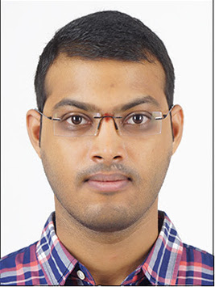
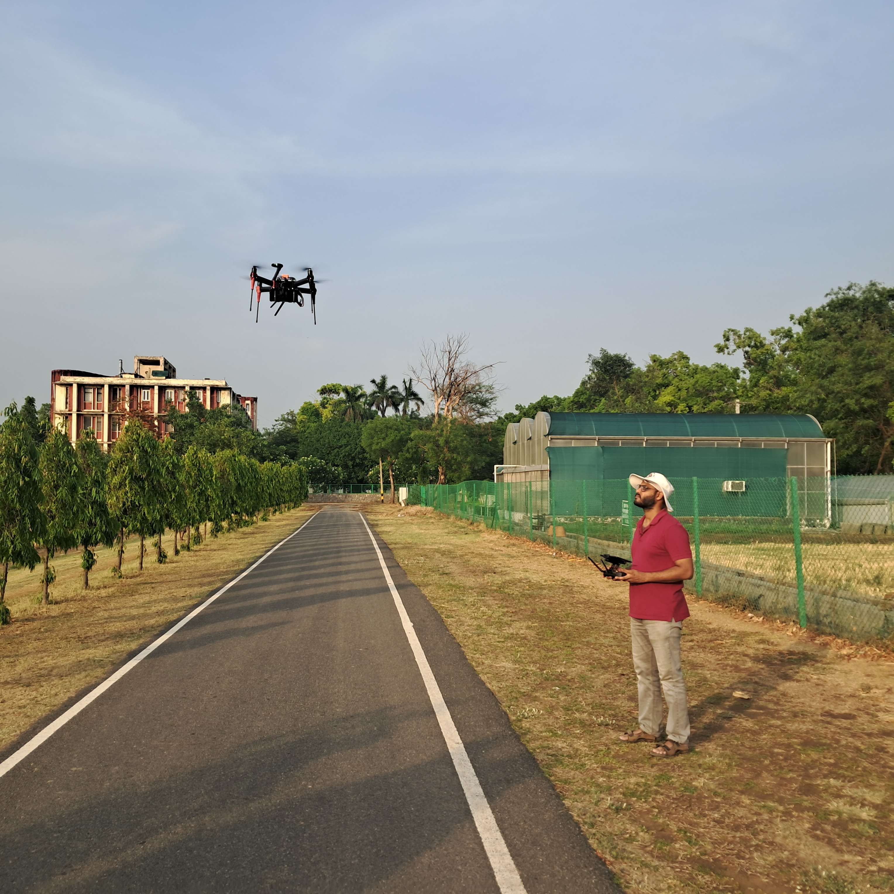
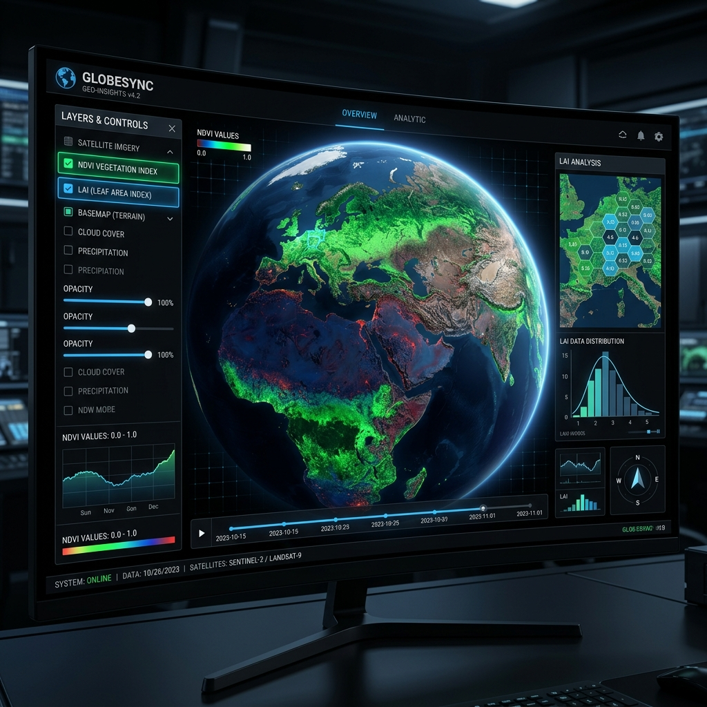
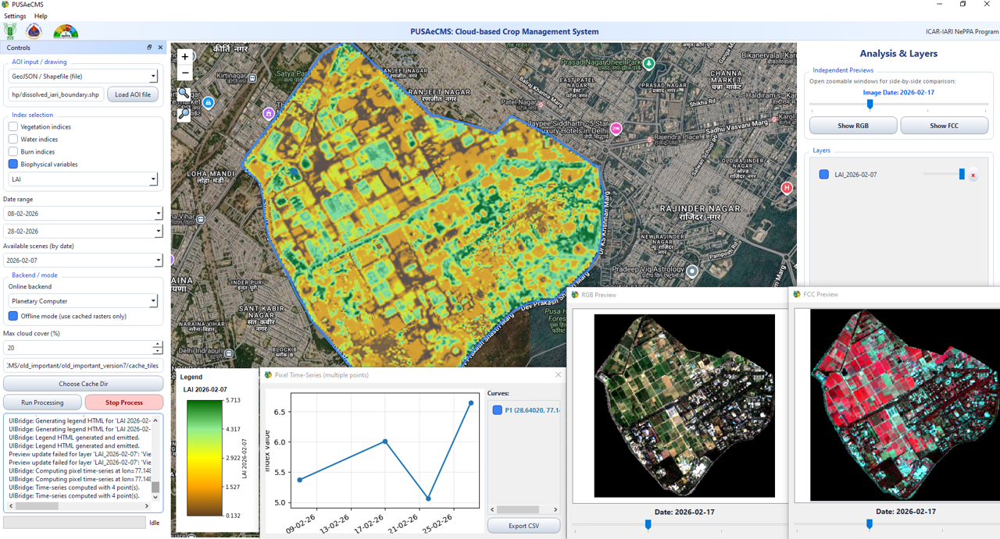
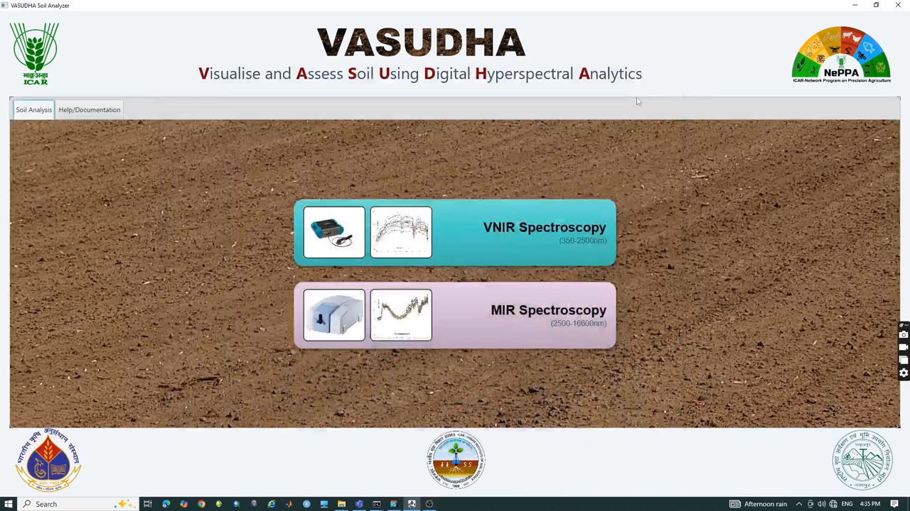
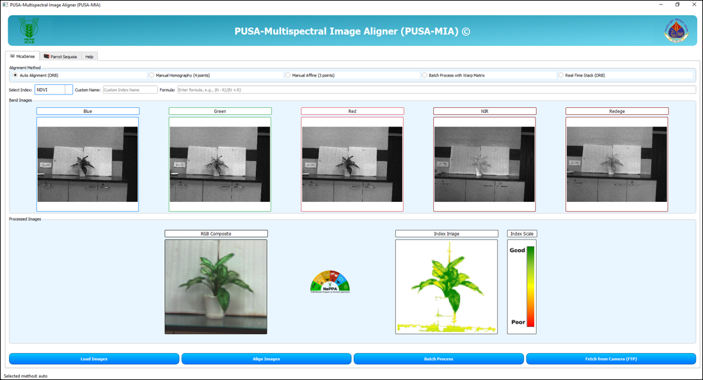
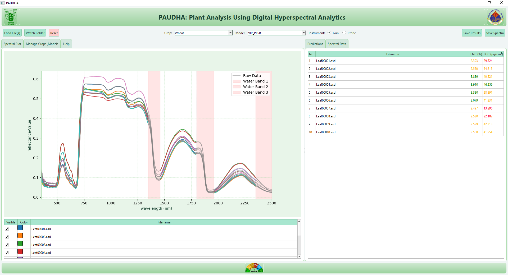
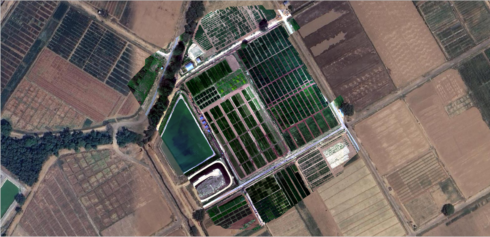
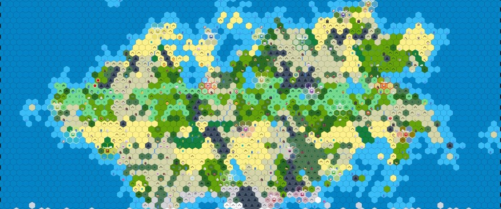

---
hide:
  - navigation
  - toc
  - path
---

  
  <h1>Dr. Tarun Teja Kondraju</h1>
  <h2>Geospatial Scientist | UAV & Remote Sensing Expert | Ph.D. in Spatial Informatics</h2>

## About Me

  
  

    
I am a geospatial researcher with a Ph.D. in Spatial Informatics, currently working at the Indian Agricultural Research Institute (ICAR-IARI). My primary research focuses on advancing transferable, reproducible remote sensing methodologies that support sustainable resource management and climate resilience.

    
    
My technical expertise spans hyperspectral and multispectral drone data analytics, Google Earth Engine (GEE) app development, and spatial physical modeling. Throughout my career, I have developed several operational geospatial products, including <strong>PUSAECMS</strong>, <strong>VASUDHA</strong>, and <strong>PUSAMIA</strong>, which facilitate real-time agricultural and environmental monitoring.

    
    
Whether I am modeling water quality in inland reservoirs or scaling up plant chlorophyll retrieval using Gaussian process regression, my goal is to develop tools that allow users to make quick, practical, and data-driven decisions.

  

  

    
  

## Core Competencies

* **Cloud & Web GIS:** Google Earth Engine app development and big data processing.
* **Satellite Data Processing:** Optical and SAR data processing.
* **UAV Analytics:** Processing multispectral, hyperspectral, and thermal data.
* **Spatial Algorithms:** Machine learning integration, physical modeling, and raster/vector processing.

## My Projects

**[PCMS](projects/pcms.md)**

A dynamic, multi-backend application that streams satellite imagery and generates Biophysical models (LAI, CCC, CWC).

[View Project →](projects/pcms.md){ .md-button }

**[PUSAECMS](projects/pusaecms.md)**

A Google Earth Engine-based application for efficient big data processing.

[View Project →](projects/pusaecms.md){ .md-button }

**[VASUDHA](projects/vasudha.md)**

An application to monitor soil health offline using MIR spectra.

[View Project →](projects/vasudha.md){ .md-button }

**[PUSAMIA](projects/pusamia.md)**

An automated edge-computing pipeline designed for multispectral images of crops.

[View Project →](projects/pusamia.md){ .md-button }

**[PAUDHA](projects/paudha.md)**

An analytical tool designed to assess crop health traits from massive volumes of data.

[View Project →](projects/paudha.md){ .md-button }

**[FieldMapper](projects/fieldmapper.md)**

A robust, open-source Python photogrammetry application for drone imagery.

[View Project →](projects/fieldmapper.md){ .md-button }

**[EdgeProcessing](projects/edgeprocessing.md)**

Edge Processing of Multispectral Data from UAV-mounted cameras in real-time.

[View Project →](projects/edgeprocessing.md){ .md-button }

**[Civ 5 AI Advisor](projects/civ5-ai-advisor.md)**

Live game state extraction and LLM integration tool for Civilization V.

[View Project →](projects/civ5-ai-advisor.md){ .md-button }

