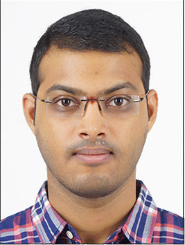
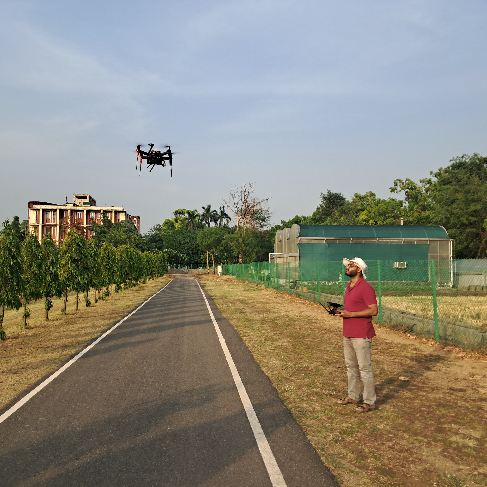
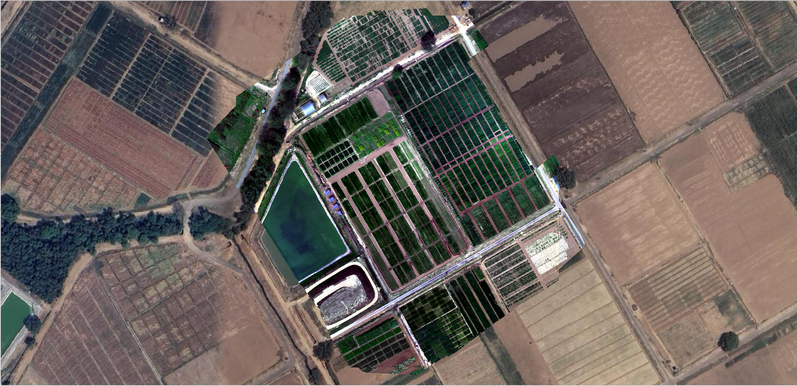
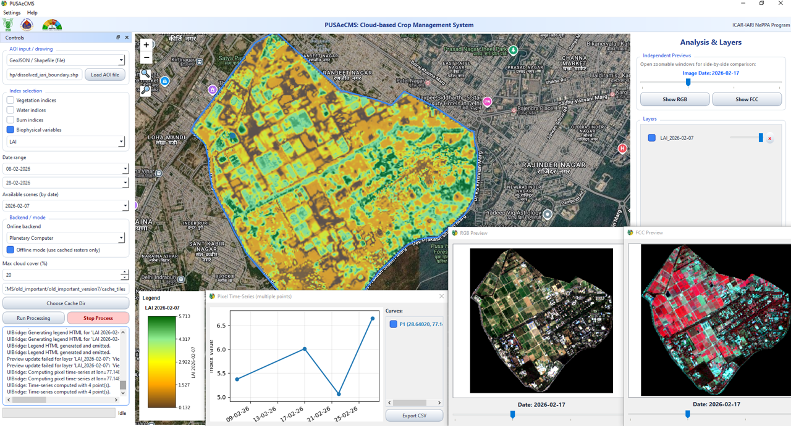
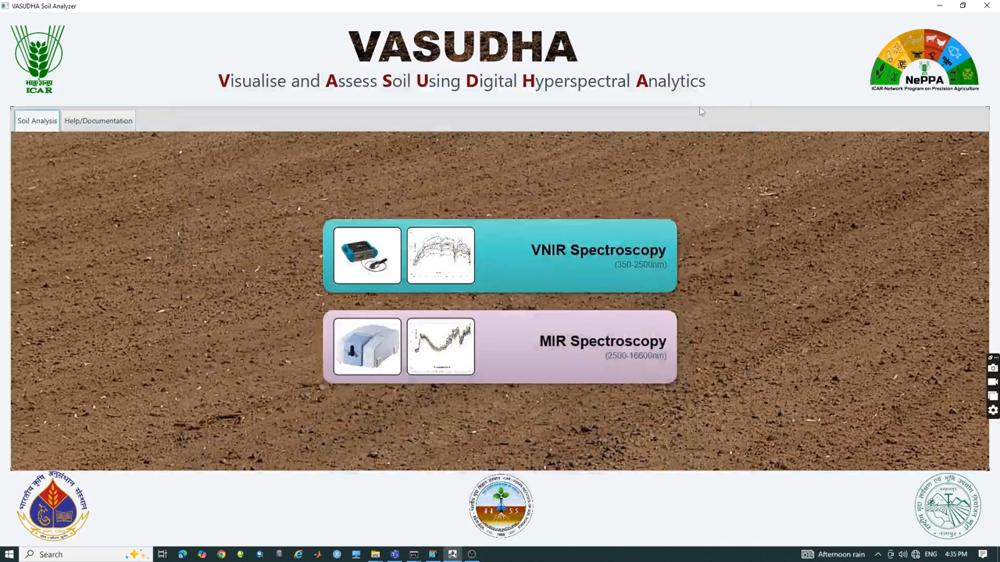
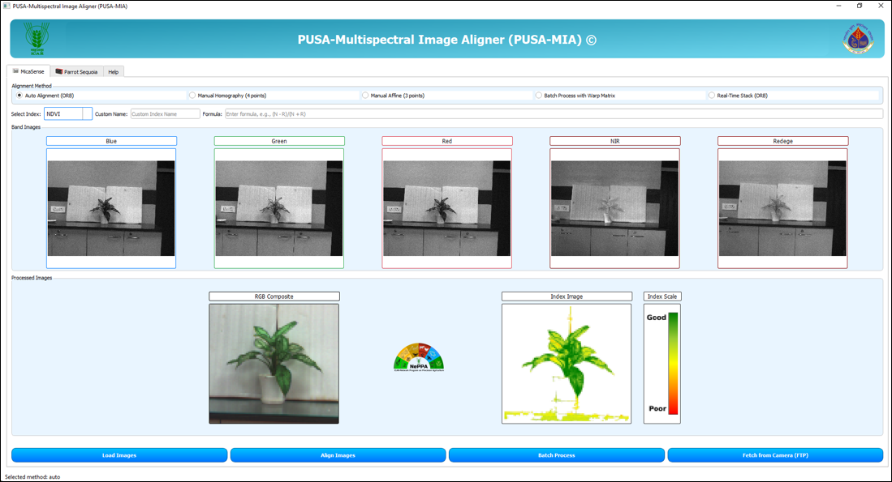
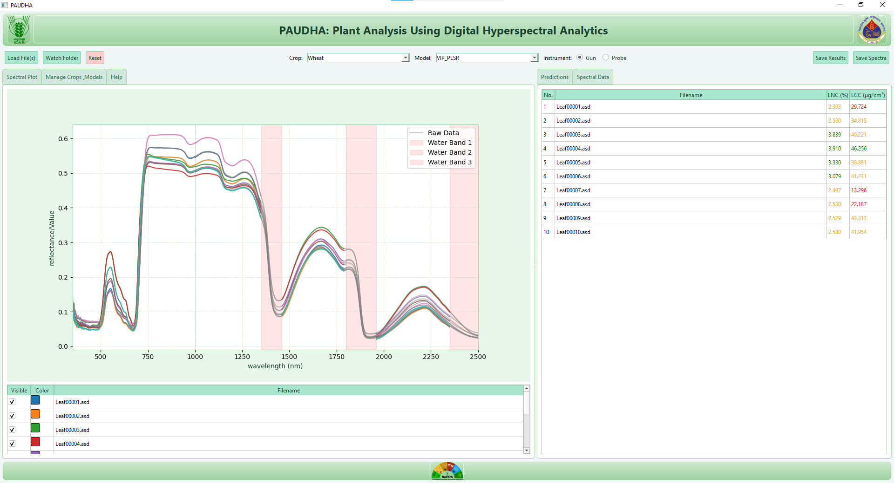
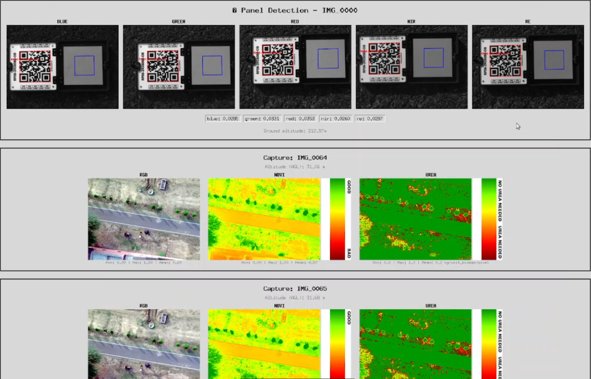
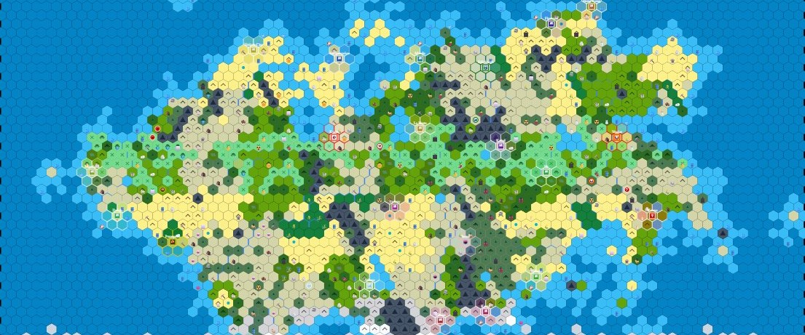

---
hide:
  - navigation
  - toc
  - path
---

  
  <h1>Dr. Tarun Teja Kondraju</h1>
  <h2>Geospatial Scientist | UAV & Remote Sensing Expert | Ph.D. in Spatial Informatics</h2>
  
I turn satellite, drone and field-sensor data into tools that people use to manage crops, soil and water.

  

    <a class="md-button md-button--primary" href="assets/TarunKondraju-CV.pdf" download>Download CV</a>
    <a class="md-button" href="projects/">Projects</a>
    <a class="md-button" href="publications/">Publications</a>
    <a class="md-button" href="https://scholar.google.com/citations?user=rPVbmEYAAAAJ">Google Scholar</a>
    <a class="md-button" href="contact/">Contact</a>
  

  
<strong>12+ yrs</strong>remote sensing & GIS R&amp;D

  
<strong>1 book</strong>on drone imaging (2026)

  
<strong>24</strong>peer-reviewed papers

  
<strong>190</strong>citations · h-index 7

  
<strong>6</strong>geospatial apps built

  
<strong>5</strong>sensor types: RGB, multispectral, hyperspectral, thermal, SAR

## About Me

  

    
I am a geospatial scientist with a Ph.D. in Spatial Informatics from IIIT Hyderabad, currently a post-doctoral Research Associate at the Indian Agricultural Research Institute (ICAR-IARI), New Delhi. For more than twelve years I have worked across the full chain of Earth observation – flying drones, collecting field spectra, processing satellite archives, building machine-learning and physical models, and shipping the software that puts the results in people's hands.

    
My work spans crop health, soil health and soil moisture, reservoir water quality and coastal ecosystems. I have built six geospatial applications – among them a Google Earth Engine platform for near-real-time crop monitoring and <strong>DroneMapper</strong>, a desktop drone-mapping suite comparable to Pix4D – co-authored the book <em>Drone Imaging and Analytics for Agriculture</em> (ICAR-IARI, 2026), and published 24 peer-reviewed papers. I also enjoy teaching: I have taught university students for eight years and trained faculty, scientists and working professionals across India.

  

  

    
  

## How I Can Help You

### :material-school: Universities & Academia
Eight years of university teaching at IIIT Hyderabad, faculty training across India, and a 2026 book on drone imaging that can anchor new courses. Ready to teach remote sensing, GIS, drone mapping and Google Earth Engine – and to build a funded research group.

### :material-satellite-variant: GIS & Remote Sensing Companies
End-to-end Earth-observation delivery: Sentinel-1/2 and Landsat processing, drone photogrammetry with my own software (DroneMapper), Google Earth Engine apps, and client-ready orthomosaics, elevation models and index maps.

### :material-sprout: Agriculture & AgriTech
Crop health, chlorophyll, leaf area and nitrogen from drones and satellites; soil N, P, K and organic carbon from spectroscopy; real-time drone processing for urea (nitrogen) requirement maps.

### :material-shield-check: Insurance & Risk
Crop-condition monitoring through the season, soil moisture from radar for drought stress, and rapid drone surveys to verify what satellites show – the evidence behind underwriting, loss assessment and claims.

### :material-water: Environmental Organisations
Reservoir water quality and algal blooms from Sentinel-2, nutrient loading with SWAT watershed models, land-use change, urban lakes and coral-reef assessment.

### :material-rocket-launch: Startups & Research Organisations
Six applications taken from idea to working product, plus research on ICAR, DST and APN projects. I move comfortably between science, field work and code.

## Featured Work

  ICAR-IARI · 2026
  Drone Imaging and Analytics for Agriculture
  ISBN 978-81-999568-2-7

**Book (co-author)**

Co-authored with colleagues at ICAR-IARI and published with an ISBN in 2026.

[See publications →](publications.md){ .md-button }

**DroneMapper**

My open-source desktop drone-mapping suite, comparable to Pix4D: orthomosaics, DSM/DTM and vegetation-index maps from RGB, multispectral and thermal cameras.

[View project →](projects/dronemapper.md){ .md-button }

**PUSAeCMS**

Google Earth Engine platform for near-real-time crop health monitoring at any location, with physically based estimates of leaf area and chlorophyll.

[View project →](projects/pusaecms.md){ .md-button }

## Published In

  Computers and Electronics in Agriculture
  International Journal of Remote Sensing
  Remote Sensing (MDPI)
  Journal of Contaminant Hydrology
  Regional Studies in Marine Science
  Geomatics, Natural Hazards and Risk
  Journal of the Indian Society of Remote Sensing
  ISPRS Annals &amp; Archives
  IEEE InGARSS &amp; M2GARSS

[See all publications →](publications.md)

## My Journey

  
<h3>2026 · Book published</h3>
Co-author of <em>Drone Imaging and Analytics for Agriculture</em> (ICAR-IARI).

  
<h3>2024–2025 · Invited speaker</h3>
Resource person and guest lecturer at ICAR training programmes on drone technology in agriculture.

  
<h3>2022 – present · ICAR-IARI, New Delhi</h3>
Post-doctoral Research Associate: crop and soil monitoring with drones, satellites and field spectroscopy; six applications built.

  
<h3>2021 · Senior Research Fellow, IIIT Hyderabad</h3>
DST-funded satellite monitoring of water quality in the Bhadra and Tungabhadra reservoirs.

  
<h3>2020 – 2021 · GIS Research Consultant & Trainer</h3>
Online ArcGIS and QGIS training for students and professionals (AvakAza Geoscience).

  
<h3>2013 – 2021 · Ph.D., IIIT Hyderabad</h3>
Spatial Informatics – reservoir water quality and land use; teaching assistant and faculty trainer.

  
<h3>2010 – 2012 · M.Tech., VIT Vellore</h3>
Energy and Environmental Engineering.

  
<h3>2006 – 2010 · B.Tech., Hyderabad</h3>
Biotechnology, St. Martin's Engineering College.

## Core Competencies

* **Cloud & Web GIS:** Google Earth Engine app development and big data processing.
* **Satellite Data Processing:** Optical and SAR data processing.
* **UAV Analytics:** Processing multispectral, hyperspectral, and thermal data.
* **Spatial Algorithms:** Machine learning integration, physical modeling, and raster/vector processing.
* **Software Development:** Python desktop applications (PySide6/PyQt6), photogrammetry (COLMAP, OpenMVS), edge processing for UAV payloads.

## My Projects

**[PUSA eCMS Desktop](projects/pusaecms-desktop.md)**

A dynamic, multi-backend application that streams satellite imagery and generates Biophysical models (LAI, CCC, CWC).

[View Project →](projects/pusaecms-desktop.md){ .md-button }

**[PUSAECMS](projects/pusaecms.md)**

A Google Earth Engine-based application for efficient big data processing.

[View Project →](projects/pusaecms.md){ .md-button }

**[VASUDHA](projects/vasudha.md)**

An application to monitor soil health offline using MIR spectra.

[View Project →](projects/vasudha.md){ .md-button }

**[PUSAMIA](projects/pusamia.md)**

An automated edge-computing pipeline designed for multispectral images of crops.

[View Project →](projects/pusamia.md){ .md-button }

**[PAUDHA](projects/paudha.md)**

An analytical tool designed to assess crop health traits from massive volumes of data.

[View Project →](projects/paudha.md){ .md-button }

**[DroneMapper](projects/dronemapper.md)**

A robust, open-source Python photogrammetry application for drone imagery.

[View Project →](projects/dronemapper.md){ .md-button }

**[EdgeProcessing](projects/edgeprocessing.md)**

Edge Processing of Multispectral Data from UAV-mounted cameras in real-time.

[View Project →](projects/edgeprocessing.md){ .md-button }

**[Civ 5 AI Advisor](projects/civ5-ai-advisor.md)**

Live game state extraction and LLM integration tool for Civilization V.

[View Project →](projects/civ5-ai-advisor.md){ .md-button }

**[TrikaalGuru](projects/trikaalguru.md)**

Website for Vedic and KP system based astrology predictions and kundali matching for individuals.

[View Project →](projects/trikaalguru.md){ .md-button }

## Open to Opportunities

I am looking for roles in **academia, research organisations, GIS and remote sensing companies, agriculture and environmental firms, agri-insurance and startups** – faculty and scientist posts, project and consulting roles, and product teams building with Earth-observation data.

<a class="md-button md-button--primary" href="mailto:tarun.kondraju@gmail.com">Email me</a>
<a class="md-button" href="https://www.linkedin.com/in/dr-tarun-kondraju-ph-d-99493372/">LinkedIn</a>
<a class="md-button" href="assets/TarunKondraju-CV.pdf" download>Download CV</a>

