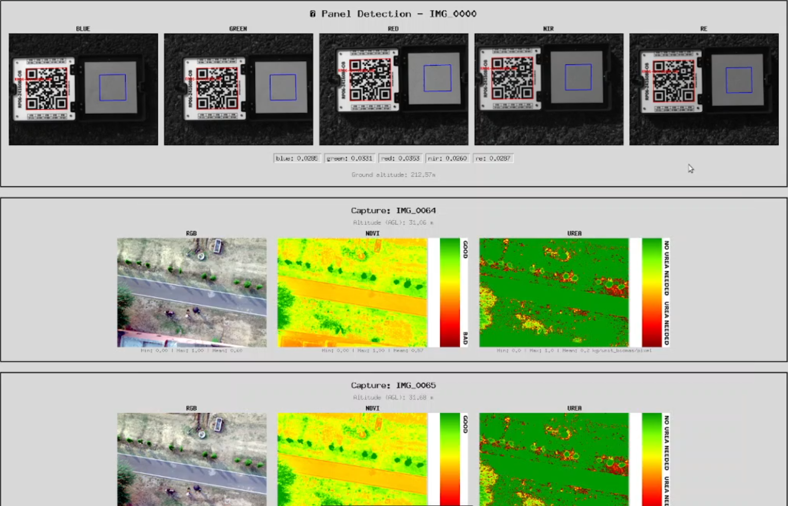

# EdgeProcessing : Processing UAV Multispectral Data at the Edge

## Overview

Edge Processing of Multispectral Data is an automated pipeline  designed to co-register, layer stack, and conduct Urea requirement assessments of crops from UAV - mounted Multispectral images in real-time.

**Study Area:** Global Application  
**Duration:** 2022 – Present  
**Role:** Lead Developer  
**Status:** Operational

---

## Methods & Tools

**Data Sources**

- Discrete multi-band imagery captured via UAV-mountable multispectral sensors (e.g., MicaSense).
- Radiometric calibration panel data (DLS).
- Proximal Images

**Processing Steps**

1. Radiometric calibration converting raw Digital Numbers (DN) to surface reflectance.
2. Feature-based detection to resolve intra-camera spatial offsets across 5 bands.
3. Affine/homography transformation for dynamic band alignment and layer-stacking.
4. On-the-fly calculation of NDVI and Urea requirement map of the crops.

**Tools Used**

| Tool | Purpose |
|------|---------|
| Multispectral Sensors | High-resolution proximal data acquisition |
| Python (OpenCV, Rasterio) | Feature detection (SIFT/ORB) and array manipulations |
| Edge Computing Hardware | Running the pipeline natively during flight operations |

---
## Key Findings

- Allows analysis of multispectral images captured from UAV-mountable sensors like MicaSense or Parrot Sequoia in real-time.
- Successfully generated fully calibrated, multi-band reflectance layer stacks from discrete snapshots in near real-time.
- Allows crop health assessment in real-time, but can be modified for various purposes and hence can be used at various industry level applications where multispectral analysis is reaquired over the traditional RGB based visual assessment. 

---

## Links

[View Code on GitHub](https://github.com/TarunKondraju){ .md-button }